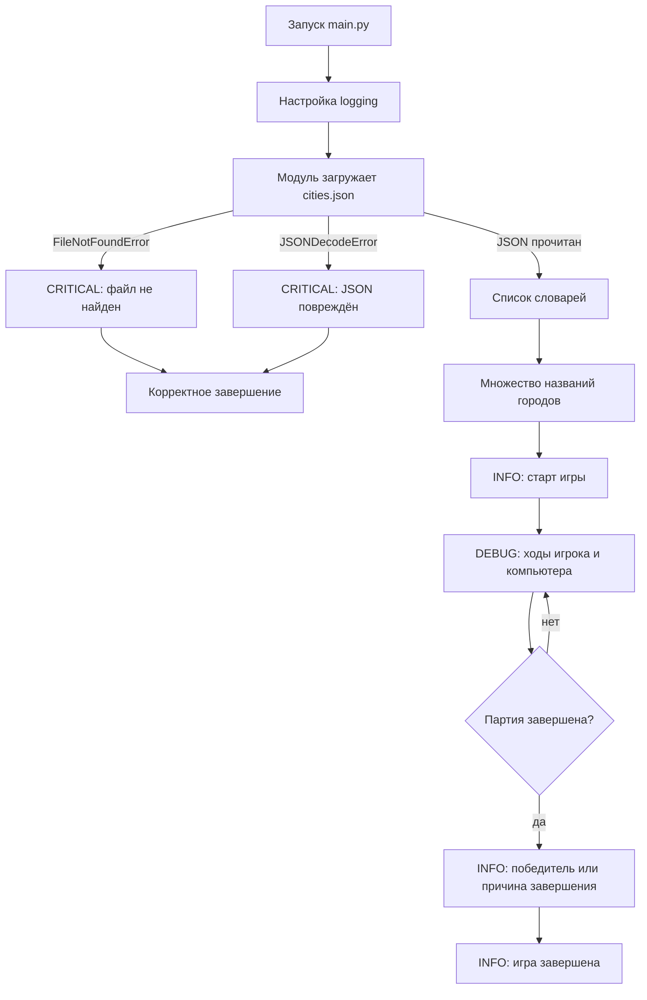

# Домашнее задание 📃

## Тема и результат

**Логирование игры «Города»: загрузка датасета из JSON, модульные логгеры и критические ошибки данных.**

>[!info]
>
>### Что получится в результате
>
>Вы вернётесь к функциональной версии игры «Города» из HW №22. Вместо импорта списка из `cities.py` программа будет загружать тот же датасет из приложенного файла `cities.json`.
>
>Игра сохранит привычный сценарий, но теперь её работу можно будет восстановить по журналу: старт и завершение партии, ходы игрока и компьютера, итог игры, а также критическая причина, по которой игра не смогла запуститься.

### Технологии

- стандартные модули `logging` и `json`;
- `logging.basicConfig()`;
- `logging.getLogger(__name__)`;
- уровни `DEBUG`, `INFO` и `CRITICAL`;
- `FileNotFoundError` и `json.JSONDecodeError`;
- модули и импорты;
- Git и история из 2–3 осмысленных коммитов;
- `colorlog` — дополнительно;
- `RotatingFileHandler` — дополнительно.

## Сценарий работы

В HW №22 список словарей импортировался из `cities.py`, а игровая логика была разбита на функции. В этой работе вы сохраняете правила игры и существующие функции, но заменяете источник данных: программа открывает `cities.json`, получает список словарей и собирает множество названий городов из поля `name`.

Настройка логирования выполняется один раз в `main.py`. В каждом Python-модуле создаётся собственный логгер через `logging.getLogger(__name__)`, поэтому в журнале видно, какая часть программы создала запись. Обычные `print()` остаются интерфейсом игрока, а журнал фиксирует события для разработчика.

Если файл с городами отсутствует или содержит повреждённый JSON, продолжать игру нельзя. Программа перехватывает соответствующее исключение, записывает событие уровня `CRITICAL` и корректно завершает запуск без длинного traceback в терминале.

## Схема работы



## Задание

### Этап 1. Подготовить проект из HW №22

Возьмите свою функциональную версию игры «Города» из HW №22. Сохраните игровую механику: проверку существования города, правило последней буквы, запрет повторов, ход компьютера и команду завершения.

Добавьте в проект приложенный файл `cities.json`. Он содержит **1132 записи** и сохраняет структуру прошлого `cities.py`: каждый элемент — словарь с полями `name`, `coords`, `district`, `population` и `subject`.

Фрагмент структуры датасета:

```json
[
  {
    "coords": {"lat": "52.65", "lon": "90.08333"},
    "district": "Сибирский",
    "name": "Абаза",
    "population": 14816,
    "subject": "Хакасия"
  }
]
```

Имя приложенного файла `cities.json` сохраняется, чтобы преподаватель мог запустить все работы с одним датасетом. Изменять или дополнять сам датасет не требуется.

### Этап 2. Разделить программу минимум на два Python-файла

В проекте должны быть:

- `main.py` — точка входа и единственное место общей настройки логирования;
- минимум один дополнительный Python-модуль с загрузкой данных или игровой логикой;
- `cities.json` — приложенный датасет;
- `.log`-файл, созданный программой.

Название дополнительного модуля и лог-файла выберите самостоятельно. Например, модуль можно назвать `game.py`, `city_game.py` или `data_loader.py`.

В `main.py` и каждом дополнительном модуле создайте локальный логгер:

```python
logger = logging.getLogger(__name__)
```

Передавать один объект логгера параметром во все функции не нужно. Имя `__name__` позволит увидеть в журнале модуль-источник сообщения.

### Этап 3. Загрузить датасет и обработать две критические ошибки

В отдельном модуле создайте функцию загрузки данных. Она должна открыть `cities.json` в кодировке UTF-8 и прочитать список через `json.load()`.

Нужно отдельно перехватить два исключения:

| Исключение | Когда возникает | Что делает программа |
|---|---|---|
| `FileNotFoundError` | Файл `cities.json` отсутствует или переименован | Записывает `CRITICAL` о том, что датасет не найден, и прекращает запуск игры |
| `json.JSONDecodeError` | Файл существует, но его содержимое не является корректным JSON | Записывает `CRITICAL` о повреждении датасета и прекращает запуск игры |

Пример формы обработчика — это подсказка для функции загрузки, а не готовое решение игры:

```python
import json

def load_cities() -> list[dict] | None:
    try:
        with open("cities.json", encoding="utf-8") as file:
            return json.load(file)
    except FileNotFoundError:
        logger.critical("Не найден файл с датасетом городов")
        return None
    except json.JSONDecodeError:
        logger.critical("Не удалось декодировать JSON с городами")
        return None
```

После успешной загрузки используйте поле `name` каждого словаря и подготовьте множество названий так же, как в HW №22. Если загрузка завершилась неудачно, игровой цикл запускаться не должен.

### Этап 4. Настроить логирование в `main.py`

Общая настройка выполняется через `logging.basicConfig()` **только в `main.py`**. Обязательная конфигурация должна:

- принимать сообщения начиная с уровня `DEBUG`;
- выводить журнал в терминал;
- записывать тот же журнал в файл с кодировкой UTF-8;
- показывать время, уровень, имя логгера и сообщение;
- добавлять новые записи при последующих запусках, а не стирать предыдущие.

Пример базовой настройки:

```python
import logging

logging.basicConfig(
    level=logging.DEBUG,
    format="%(asctime)s | %(levelname)s | %(name)s | %(message)s",
    datefmt="%Y-%m-%d %H:%M:%S",
    handlers=[
        logging.StreamHandler(),
        logging.FileHandler("game.log", mode="a", encoding="utf-8"),
    ],
)
```

Название `.log`-файла можно изменить. Не копируйте пример механически: проверьте, что именно ваш файл создаётся и пополняется после каждого запуска.

### Этап 5. Добавить события игры

Используйте уровни по смыслу:

| Уровень | Обязательные события |
|---|---|
| `INFO` | Игра успешно запущена после загрузки датасета; игра завершена; указан итог — победа игрока, победа компьютера или выход по команде |
| `DEBUG` | Ход игрока; ход компьютера; при необходимости количество оставшихся доступных городов или буква для следующего хода |
| `CRITICAL` | Невозможно начать игру из-за отсутствующего `cities.json` или повреждённого JSON |

Уровень `ERROR` в этой работе **не требуется**. Не добавляйте искусственную ошибку только ради ещё одного уровня.

Примеры смысла сообщений:

```python
logger.info("Игра началась")
logger.debug(f"Игрок сделал ход: {user_city}")
logger.debug(f"Компьютер сделал ход: {computer_city}")
logger.info("Игрок победил: компьютер не нашёл подходящий город")
logger.critical("Игра не может начаться: файл cities.json не найден")
```

Это примеры, а не обязательные дословные формулировки. Событие должно отвечать на вопрос «что произошло?», а уровень — показывать важность события. Не записывайте весь список городов целиком: для диагностики достаточно конкретного хода, следующей буквы или количества оставшихся городов.

`print()` и `logging` решают разные задачи:

- через `print()` игрок видит приглашение, ответы компьютера и результат партии;
- через `logger` разработчик получает последовательный журнал событий.

Тексты сообщений выбираются самостоятельно. В логах не нужно сохранять весь датасет или большие структуры целиком.

### Этап 6. Проверить три сценария

Все проверки выполняются последовательно, чтобы записи накопились в одном `.log`-файле.

1. **Обычная игра.** Запустите программу с корректным `cities.json`, сделайте несколько ходов и завершите партию. В журнале должны появиться старт, ходы, итог и завершение.
2. **Файл не найден.** Временно переименуйте `cities.json`, запустите программу и проверьте запись `CRITICAL`. После проверки верните исходное имя.
3. **JSON повреждён.** Временно нарушьте синтаксис файла, например удалите закрывающую квадратную скобку, запустите программу и проверьте вторую запись `CRITICAL`. Затем восстановите исходный файл из приложенного бандла.

После ошибок программа должна завершаться управляемо: игровой цикл не начинается, а причина видна в терминале и `.log`-файле.

### Этап 7. Зафиксировать работу в Git

Выполняйте HW №26 в Git-репозитории. Можно продолжить существующий локальный репозиторий или создать новый для этой работы.

Сделайте **2 или 3 осмысленных коммита**, относящихся к этому заданию. Например, отдельными этапами могут быть переход на JSON, добавление модульного логирования и проверка критических сценариев. Тексты коммитов выбираются самостоятельно и должны кратко объяснять выполненное изменение.

После завершения выведите последние коммиты:

```bash
git log --oneline --max-count=3
```

Сделайте читаемый скриншот терминала. На нём должны быть видны 2–3 коммита этой работы и их сообщения.

## Дополнительно: цветное логирование

За цветное логирование можно получить **1 дополнительный балл**. Используйте рассмотренную на занятии библиотеку `colorlog`:

```bash
uv add colorlog
```

Минимальный пример цветного форматтера для терминала:

```python
from colorlog import ColoredFormatter

console_handler = logging.StreamHandler()
console_handler.setFormatter(
    ColoredFormatter(
        "%(log_color)s%(levelname)-8s%(reset)s | %(name)s | %(message)s",
        log_colors={
            "DEBUG": "cyan",
            "INFO": "green",
            "CRITICAL": "bold_white,bg_red",
        },
    )
)
```

Подключите `console_handler` через список `handlers` в `logging.basicConfig()`. Цвет нужен только в терминале; записи в `.log`-файле должны оставаться обычным текстом без управляющих цветовых последовательностей.

## Дополнительно: ротация логов

За ротацию можно получить ещё **1 дополнительный балл**. Вместо обычного `FileHandler` используйте `RotatingFileHandler`:

```python
from logging.handlers import RotatingFileHandler

RotatingFileHandler(
    "game.log",
    maxBytes=1_000_000,
    backupCount=3,
    encoding="utf-8",
)
```

Установите ограничение примерно **1 МБ на файл** и выберите от **2 до 5 резервных копий**. Допустимы другие разумные значения, если рядом с настройкой есть короткий комментарий, объясняющий выбор. Специально генерировать мегабайты игровых записей и прикладывать все резервные файлы не требуется.

## Свобода реализации

Вы самостоятельно выбираете:

- название дополнительного модуля и способ распределения игровых функций;
- название `.log`-файла;
- формулировки сообщений;
- дополнительные события `DEBUG`;
- конкретный способ сообщить пользователю о невозможности запуска;
- использовать ли `colorlog` и ротацию.

Обязательными остаются `main.py`, приложенный `cities.json`, минимум один дополнительный Python-модуль, настройка `logging.basicConfig()` в `main.py`, модульные логгеры через `logging.getLogger(__name__)` и три проверяемых сценария.

## Что нужно сдать

Соберите один `.zip`-архив всей папки проекта-репозитория. Код к моменту упаковки должен быть запущен, а итоговый `.log`-файл — уже сформирован после обычной игры и двух проверок ошибок.

| Материал | Обязательно | Что подтверждает |
|---|---:|---|
| `main.py`, дополнительный модуль или модули и остальные файлы исходного кода | Да | Рабочий проект, точку входа и модульные логгеры |
| `cities.json` | Да | Работу с приложенным датасетом |
| Уже сформированный итоговый `.log`-файл | Да | Фактический запуск кода: обычную игру и две критические ошибки |
| Скриншот истории Git | Да | Последние 2–3 осмысленных коммита этой работы |
| `pyproject.toml` | Только при использовании `colorlog` | Наличие дополнительной зависимости |

Имя ZIP-архива, дополнительного модуля, лог-файла и изображения свободны. Ссылка на GitHub не требуется: работа проверяется по проекту в архиве, журналу и скриншоту локальной истории.

>[!warning]
>
>### Перед упаковкой
>
>Не добавляйте в архив `.venv`, скрытую служебную папку `.git`, `__pycache__`, настройки редактора и другие служебные файлы. Саму папку проекта с исходным кодом, `.gitignore`, датасетом, сформированным логом и скриншотом истории добавить нужно. Перед сдачей восстановите корректный `cities.json` и убедитесь, что игра снова запускается.

## Самопроверка перед сдачей

- [ ] Игра загружает данные из `cities.json`, а не импортирует `cities_list` из `cities.py`.
- [ ] После загрузки по полю `name` создаётся множество названий городов.
- [ ] В проекте есть `main.py` и минимум один дополнительный Python-модуль.
- [ ] `logging.basicConfig()` вызывается только в `main.py`.
- [ ] В каждом модуле с событиями используется `logging.getLogger(__name__)`.
- [ ] `INFO` показывает старт, итог и завершение игры.
- [ ] `DEBUG` показывает ходы игрока и компьютера.
- [ ] Обе ошибки датасета перехватываются и записываются как `CRITICAL`.
- [ ] При ошибке датасета игровой цикл не начинается.
- [ ] Уровень `ERROR` не добавлен искусственно.
- [ ] Итоговый лог содержит обычный запуск и обе критические проверки.
- [ ] Код запускался до упаковки, а итоговый `.log`-файл не пустой.
- [ ] В Git создано 2 или 3 осмысленных коммита для этой работы.
- [ ] На скриншоте читаются хэши и сообщения этих коммитов.
- [ ] В ZIP нет служебных каталогов, а `cities.json` восстановлен.

## Обязательный контракт

### Проверяемые требования

| ID | Обязательный результат | Как проверить |
|---|---|---|
| `REQ-01` | Программа загружает приложенный `cities.json` через `json.load()` и создаёт множество названий из поля `name` | Исходный код и успешный запуск игры |
| `REQ-02` | `FileNotFoundError` перехватывается, записывается как `CRITICAL`, после чего игра не запускается | Код загрузчика и итоговый `.log`-файл |
| `REQ-03` | `json.JSONDecodeError` перехватывается, записывается как `CRITICAL`, после чего игра не запускается | Код загрузчика и итоговый `.log`-файл |
| `REQ-04` | Общая настройка через `logging.basicConfig()` находится в `main.py` и направляет журнал в терминал и UTF-8 `.log`-файл | `main.py` и итоговый `.log`-файл |
| `REQ-05` | В проекте есть минимум один дополнительный Python-модуль, а логгеры создаются через `logging.getLogger(__name__)` | Структура и исходный код проекта, поле имени логгера в журнале |
| `REQ-06` | В успешной партии уровень `INFO` фиксирует старт, итог и завершение, а `DEBUG` — ходы игрока и компьютера | Итоговый `.log`-файл |
| `REQ-07` | Сдан один ZIP с запускаемым кодом, корректным `cities.json` и уже сформированным журналом трёх проверенных сценариев | Содержимое архива, журнал и повторный запуск |
| `REQ-08` | Работа зафиксирована в Git двумя или тремя осмысленными коммитами | Скриншот `git log --oneline --max-count=3` |

### Дополнительные требования

| ID | Дополнительный результат | Бонус |
|---|---|---:|
| `BONUS-01` | Терминал использует осмысленное цветное форматирование через `colorlog`, а файл остаётся обычным текстом | +1 |
| `BONUS-02` | Файловый обработчик заменён на корректно настроенный `RotatingFileHandler` с ограничением размера и резервными копиями | +1 |

Бонусы не заменяют обязательные требования. Без дополнительных частей полностью выполненная работа получает 12 баллов; с обеими — до 14 баллов.

## Что не требуется и не оценивается

- Уровень `ERROR` и искусственно созданная ошибка ради него.
- Точное совпадение текстов сообщений с примерами.
- Конкретное название дополнительного модуля, лог-файла и ZIP-архива.
- Изменение правил игры, новый интерфейс или дополнительный режим.
- Классы, тесты, база данных и сторонняя библиотека логирования в обязательной части.
- Новый GitHub-репозиторий, feature-ветка, конфликт или Pull Request.
- Папка `.git` внутри сдаваемого ZIP: историю подтверждает обязательный скриншот.
- Фактическое заполнение ротационных файлов до 1 МБ.

## Фокус проверки

Проверяется управляемое логирование существующей игры: единая настройка в точке входа, именованные модульные логгеры, осмысленное разделение событий по `DEBUG`, `INFO` и `CRITICAL`, а также корректная реакция на две ошибки загрузки JSON. Оформление сообщений, названия внутренних функций и дополнительного модуля не оцениваются, если роли частей понятны и все сценарии воспроизводятся.

## Критерии проверки 👌

Дополнительные части оцениваются отдельно и могут увеличить итог до 14 баллов:

| Дополнительная часть | Условие бонуса | Баллы |
|---|---|---:|
| Цветное логирование через `colorlog` | Терминальные уровни различаются цветом, в `.log` нет цветовых кодов (`BONUS-01`) | **+1** |
| Ротация логов | Корректно подключён `RotatingFileHandler`, задан размер и число резервных копий (`BONUS-02`) | **+1** |

Обязательная часть оценивается на 12 баллов:

| Категория | Полное выполнение | Частичное выполнение | Баллы |
|---|---|---|---:|
| Загрузка JSON и критические ошибки | `cities.json` читается через `json.load()`; отдельно перехватываются `FileNotFoundError` и `JSONDecodeError`; обе причины записываются как `CRITICAL`, игра не запускается (`REQ-01`–`REQ-03`) | Датасет загружается, но одна ошибка не перехвачена, имеет неверный уровень либо после неё начинается игра | 3 |
| Настройка и модульные логгеры | `basicConfig()` находится в `main.py`, журнал идёт в терминал и UTF-8 файл; есть отдельный модуль и `getLogger(__name__)` (`REQ-04`, `REQ-05`) | Логирование работает, но настройка дублируется, отсутствует один обработчик или имя модуля не видно | 3 |
| События игры | `INFO` фиксирует старт, итог и завершение; `DEBUG` фиксирует ходы обоих участников; уровни выбраны осмысленно (`REQ-06`) | Логи есть, но часть обязательных событий отсутствует либо уровни смешаны | 4 |
| Работоспособность, Git и сдача | Игра работает с восстановленным датасетом; ZIP содержит проект, JSON и сформированный журнал; скриншот показывает 2–3 осмысленных коммита (`REQ-07`, `REQ-08`) | Игра или материалы проверяются частично, лог не подтверждает все запуски либо история Git показана неполно | 2 |
| **Итого** | Максимум с двумя дополнительными частями — 14 баллов |  | **12** |
